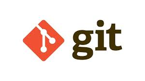

# DESPLIEGUEGIT


## Descripción del Repositorio

Este repositorio contiene el código fuente y los archivos relacionados con mi DESPLIEGUEGIT. Aquí tienes una breve descripción de los aspectos más destacados:

### Contenido del Repositorio

- **Carpeta A:** Contiene...
- **Carpeta B:** Aquí encontrarás...
- **Carpeta C:** Este archivo realiza...

## Características Principales

Destacamos algunas características clave del proyecto:

1. **_Característica 1:_** Descripción breve y relevante.
2. **_Característica 2:_** Otra descripción importante.

## Instalación y Uso

Para utilizar este proyecto, sigue estos pasos:

1. Clona el repositorio: `git@github.com:santigg16/DESPLIEGUEGIT.git`
2. Instala las dependencias: `npm install`
3. Ejecuta la aplicación: `npm start`

## Más Detalles

Para obtener más información, consulta la [documentación completa](docs/README.md).

## Capturas de Pantalla


*Descripción de la captura de pantalla.*

## Código de Ejemplo

A continuación se muestra un ejemplo de código en JavaScript:

```javascript
function helloWorld() {
    console.log("Hello, world!");
}
